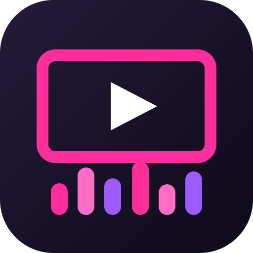

<h1> Party Video</h1>

**Ein Video statt Balken: Kodi-Addon, das zu deiner Musik ein stummes Video in
Endlosschleife zeigt — einen YouTube-Clip oder eine Datei von der Platte.**

Kodi bringt für Musik nur abstrakte Visualisierungen mit. Party Video setzt
stattdessen ein Video hinter den Klang: Lavalampe, Loop, Musikvideo, was du
willst. Der Ton kommt weiterhin von deiner Musik, das Video bleibt stumm.

---

## Voraussetzungen

| | |
|---|---|
| Gerät | Raspberry Pi 5 (aarch64) |
| System | LibreELEC 12 mit Kodi 21 „Omega“ |
| Sonstiges | nichts — kein Docker, kein Compiler, kein zusätzliches ffmpeg |

Das fertige Paket enthält eine für ARM64 übersetzte Bibliothek. Auf anderen
Plattformen läuft es nicht, ohne neu gebaut zu werden.

## Installation

1. Das aktuelle `visualization.partyvideo-*.zip` aus den
   [Releases](https://github.com/willheisenberg/visualization.partyvideo/releases)
   herunterladen und auf den Pi kopieren, etwa nach `/storage/downloads`.
2. In Kodi einmalig **Einstellungen → System → Add-ons → Unbekannte Quellen**
   erlauben.
3. **Add-ons → Aus ZIP-Datei installieren** und das Zip auswählen.
4. **Einstellungen → Player → Musik → Visualisierung** auf *Party Video* stellen.

Fertig. Beim nächsten Musiktitel öffnet sich die Visualisierung von selbst.

## Bedienung

Ein Klick auf **Party Video** unter *Add-ons → Programm-Add-ons* öffnet das
Quellenmenü:

| Eintrag | Wirkung |
|---|---|
| **Visual ein- / ausschalten** | schaltet das Video an oder aus; die Musik läuft weiter |
| **YouTube-URL eingeben** | Link eintippen, das Video wird geladen und läuft danach |
| **Videodatei wählen** | eine Datei vom Gerät auswählen |
| **Status** | zeigt, was gerade läuft |
| **Werkzeuge aktualisieren** | erneuert die Download-Hilfsprogramme |

Unter **Konfigurieren** lässt sich die maximale YouTube-Auflösung auf 720p statt
1080p begrenzen — sinnvoll, wenn das Bild ruckelt.

### Was du wissen solltest

- **Der erste YouTube-Download** installiert nach Rückfrage zwei Hilfsprogramme
  (yt-dlp und Deno, zusammen rund 100 MB), beide über Prüfsummen abgesichert.
  Das passiert nur einmal.
- **Videos werden vollständig geladen**, nicht gestreamt. Ein langes Video kann
  daher mehrere Gigabyte belegen. Während ein neues lädt, läuft das bisherige
  weiter.
- **Ausschalten gibt den Platz wieder frei:** Der YouTube-Download wird gelöscht,
  der Link aber gemerkt und beim nächsten Einschalten neu geladen. Eigene
  Videodateien werden nie gelöscht.
- **Beim Titelwechsel** erscheint die Visualisierung automatisch. Drückst du
  „Zurück“, kehrt sie nach drei Sekunden ohne Bedienung von selbst zurück;
  Einstellungen und andere Dialoge bleiben ungestört bedienbar.
- **Startest du einen Film**, hält sich das Addon vollständig heraus: Es
  dekodiert nicht und kostet keine Leistung. Nach dem Film geht es an derselben
  Stelle weiter.
- **Nach einem Kodi-Neustart** ist das Visual aus; die letzte Quelle bleibt
  gespeichert.

## Fernsteuerung

Alles lässt sich auch über Kodis JSON-RPC bedienen, etwa aus einem Chatbot oder
einem Skript. Befehle und Statusereignisse stehen in der
[Bot-API](docs/bot-api.md).

## Technisches

Das Video wird mit dem FFmpeg des Systems dekodiert und über OpenGL ES
gezeichnet. Der Decoder läuft in einem eigenen Thread und pausiert, sobald keine
Visualisierung sichtbar ist. Heruntergeladen wird nur die Videospur ohne Ton —
deshalb braucht das Gerät kein eigenes ffmpeg.

## Mitentwickeln

```sh
./build.sh    # Addon-Zip im Docker-Container bauen → dist/
./test.sh     # Python-, Kern- und Pakettests plus vollständiger Addon-Build
```

Dafür werden Docker und Python ≥ 3.11 mit einem `.venv` samt `ruff` gebraucht.
Gebaut wird für RPi5/aarch64 gegen Kodi 21.3 und System-FFmpeg 6.0.

[Design](docs/superpowers/specs/2026-09-11-partyvideo-design.md) ·
[Pläne](docs/superpowers/plans/) ·
[Testprotokolle](docs/superpowers/results/)

## Lizenz

GPL-2.0-or-later
